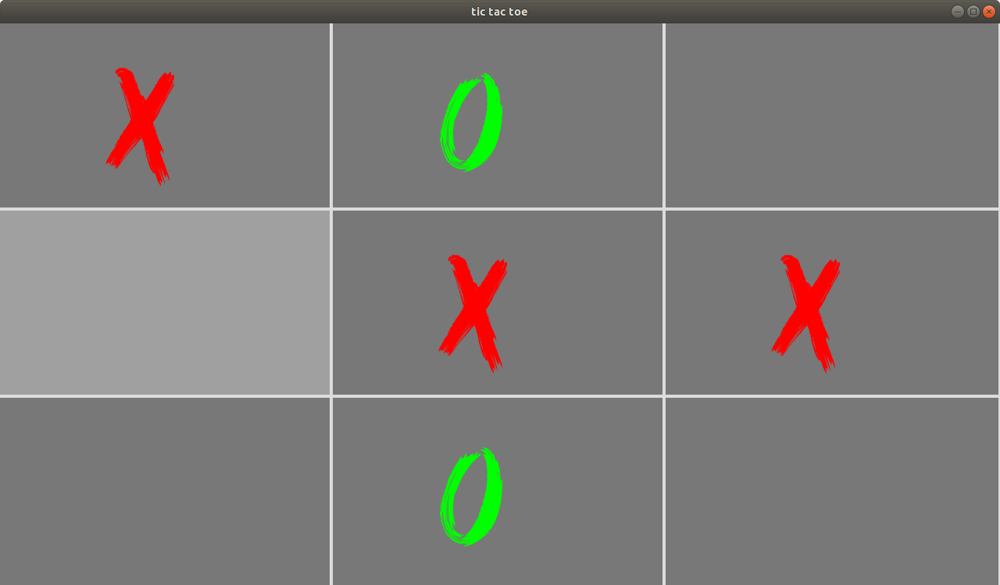
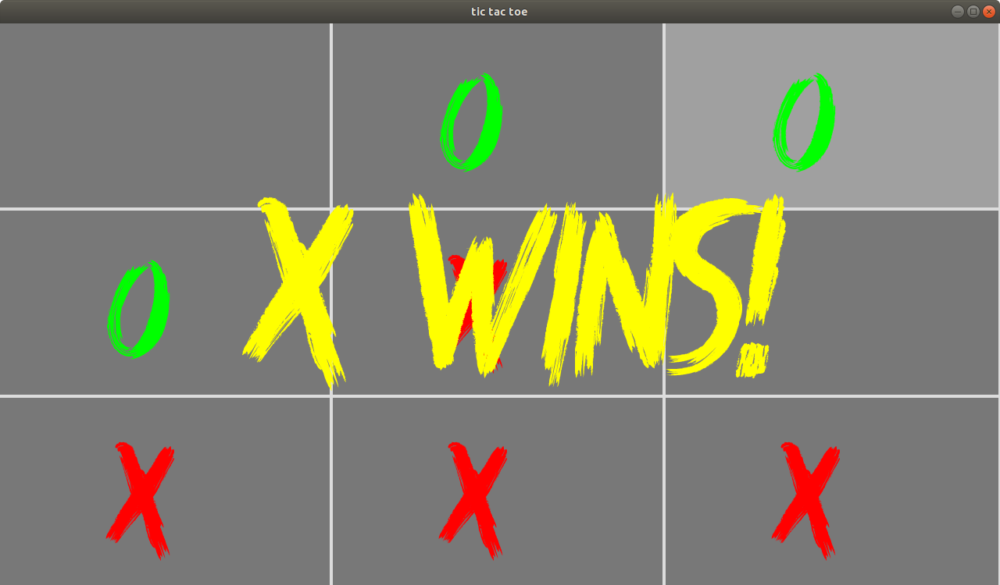

# TicTacToe
TicTacToe game in c++ and SFML and implementet minimax based bots

### Flags
`#define SHOW_SCORES`

shows how boot judges potential of move
```
(1, 0) -> 6
(2, 0) -> 6
(0, 1) -> 6
(1, 1) -> 50
(2, 1) -> 6
(0, 2) -> 6
(1, 2) -> 6
(2, 2) -> 6
best score: 50
```
___
`#define SHOW_POSSIBLE_WINS`

shows every possible game sentence boot is calculating
```
== winner: X in: 9 ==
X X O 

O X O 

X O X 

== winner: X in: 7 ==
_ _ X 

O X O 

X O X 
```




font from: 
http://www.knackpack.studio/freebies.html